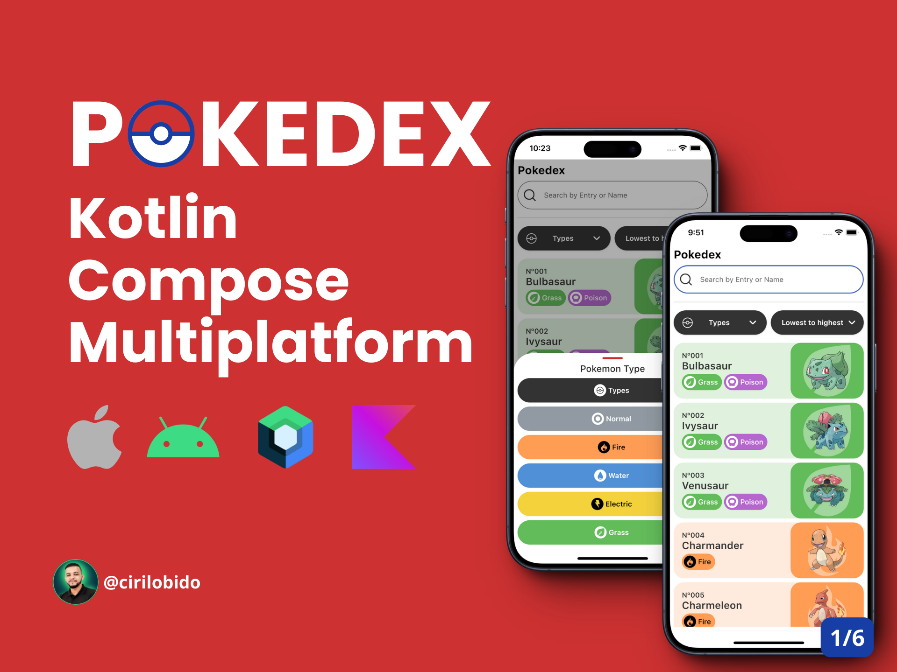
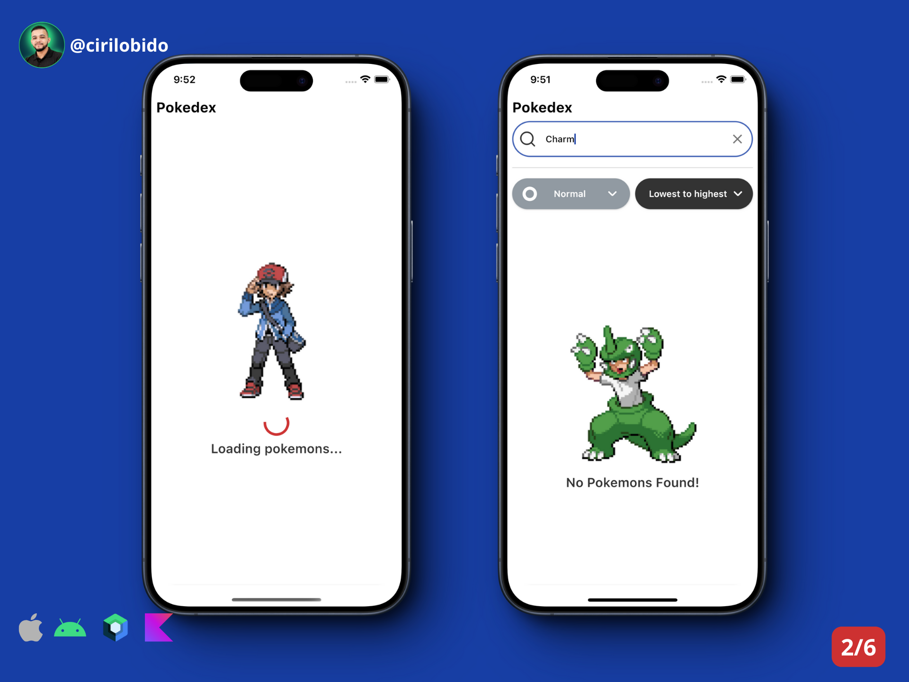
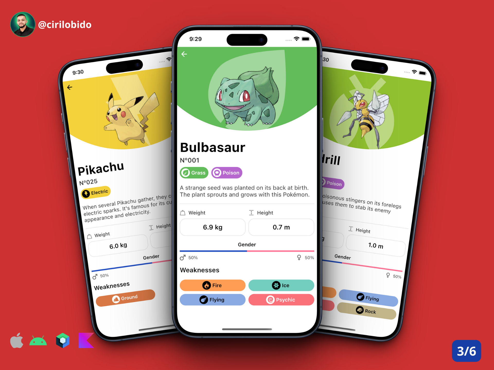
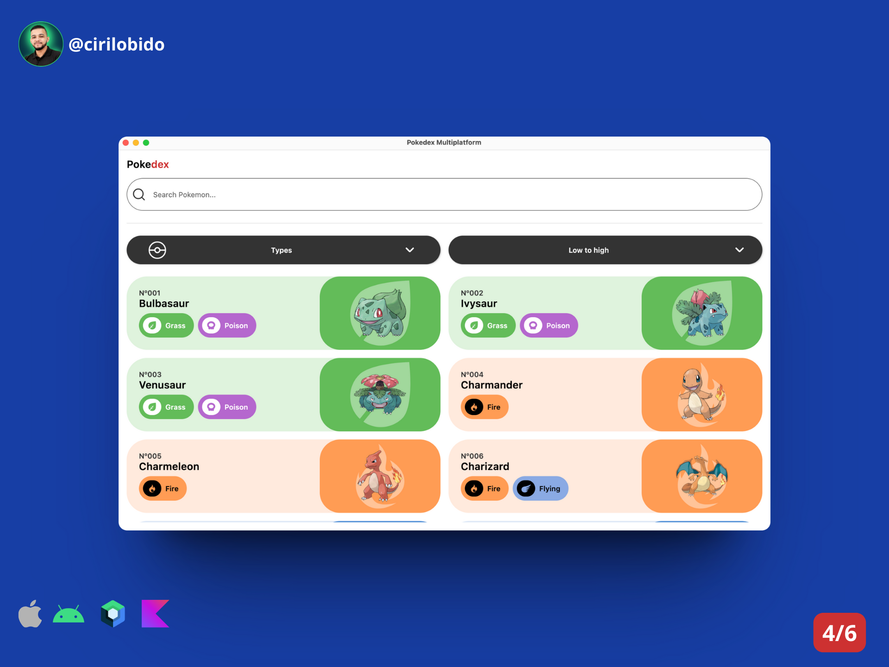
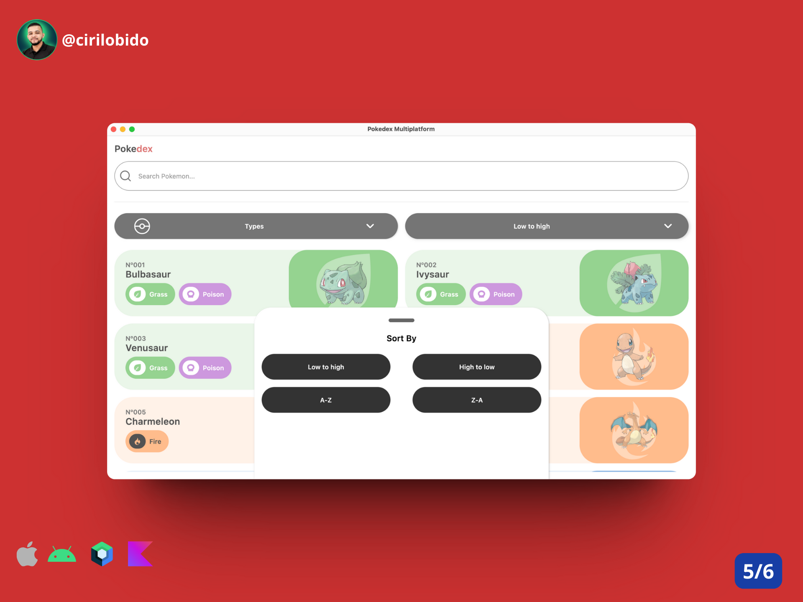

# [Compose Multiplatform](https://github.com/JetBrains/compose-multiplatform) application

**Pokedex Multiplatform** a simple multiplatform app targeting **Android, iOS and Desktop.**

> **Tools:** **Jetpack Compose,** **Kotlin,** **Clean Code**

> **Design:** **[Design Inspiration](https://www.figma.com/file/ykQAHB8kQSaJPOgcaaSk02/Pok%C3%A9dex-%2F-Pok%C3%A9mon-App-(Community)?type=design&node-id=1268-35268&mode=design&t=qOK8IXuciQNLeCPu-0)**

**NOTE:** Follow the official documentation for more information!
### [Official Documentation](https://github.com/JetBrains/compose-multiplatform) application
### Preview
**Multiplatform Preview:**

### Cirilo Bido - Android Developer

